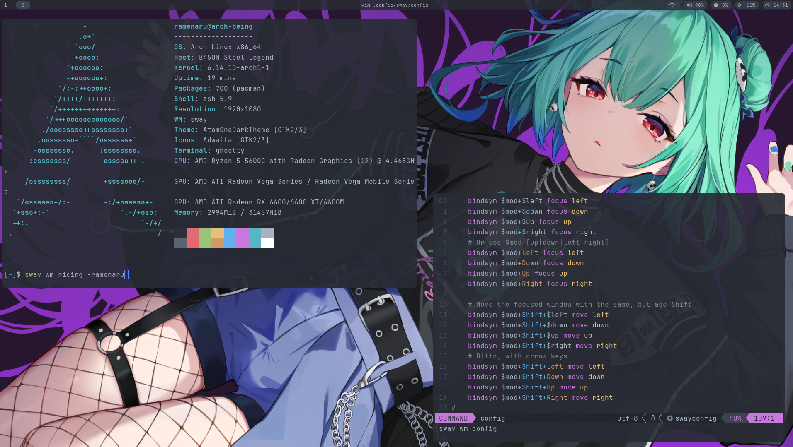

# ramenaru arch|sway-wm dotfiles

<div align="center">
  <a href="https://github.com/ramenaru/dotfiles"></a>
  <br>
  <p>*A clean, productivity-focused(anime) SwayWM setup.*</p>  
</div>

## Features
- **Theming**: One Dark Pro color scheme (VSCode-inspired)
- **Components**:
  - SwayWM (tiling window manager)
  - Waybar (custom status bar)
  - Wofi (application launcher)
  - Ghostty (Terminal)
  - Zsh, OhmyZsh (Shell)
  - Sddm (Lock Manager)
- **Keybindings**: Vim-like navigation + IDE conveniences
- **Performance**: Optimized for 165Hz displays (current test only on my devices)

## Color Scheme Reference
| Element          | Hex       | Usage Example               |
|------------------|-----------|-----------------------------|
| Background       |  `#282c34` | Terminal, Waybar background, and other major stuff |
| Foreground       |  `#abb2bf` | Text, icons                 |
| Primary          |  `#1589F0` | Active workspace, borders   |
| Secondary        |  `#56b6c2` | Inactive elements           |
| Error            |  `#e06c75` | Urgent notifications        |
| Success          |  `#98c379` | Battery full                |
| Warning          |  `#e5c07b` | Medium battery              |

*Based on [One Dark Pro](https://github.com/Binaryify/OneDark-Pro) palette*

## Installation
### Dependencies
```bash
yay -S swayfx waybar mako wofi papirus-icon-theme \
    capitaine-cursors-light jetbrains-mono-nerd-font
```

### Quick Setup
1. Backup existing configs:
   ```bash
   mv ~/.config/sway ~/.config/sway.bak
   mv ~/.config/waybar ~/.config/waybar.bak
   ```
2. Clone this repo:
   ```bash
   git clone https://github.com/ramenaru/dotfiles.git ~/.config
   ```

## Keybindings
| Key Combination          | Action                          |
|--------------------------|---------------------------------|
| `Mod+Enter`             | Launch terminal (Ghostty)       |
| `Mod+Shift+e`           | Exit session                    |
| `Mod+d`                 | Application launcher (Wofi)     |
| `Mod+e`                 | Toggle file explorer            |
| `Print`                 | Area screenshot → clipboard     |
| `XF86AudioRaiseVolume`  | Volume up (+ notification)      |

## UI Components
### Waybar Modules
```json
{
  "modules-left": ["sway/workspaces", "sway/mode"],
  "modules-center": ["clock"],
  "modules-right": ["pulseaudio", "network", "battery"]
}
```

## Theme Reference
| Component       | Theme Source                     |
|----------------|----------------------------------|
| GTK            | [One Dark Pro GTK](https://github.com/aseom/OneDark-Pro-GTK) |
| Icons          | Papirus Dark                     |
| Cursor         | Capitaine Cursors Light          |
| Terminal       | Ghostty with One Dark Pro scheme |

## Neovim Config
My neovim config is separated on another repository [nvim config](https://github.com/ramenaru/nvim) 

## Shell Conifg
I'm using [ohmyZsh](https://ohmyz.sh/) 

## Troubleshooting
**Issue**: Wrong colors in terminal  
**Fix**: Ensure `termguicolors` is set in Neovim:  
```vim
set termguicolors
colorscheme onedark
```

## License
Distributed under MIT License see [LICENSE](LICENSE) for more information.  
*"Inspired by VSCode's One Dark Pro theme"*
